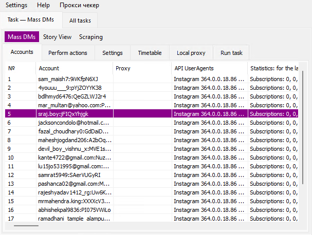
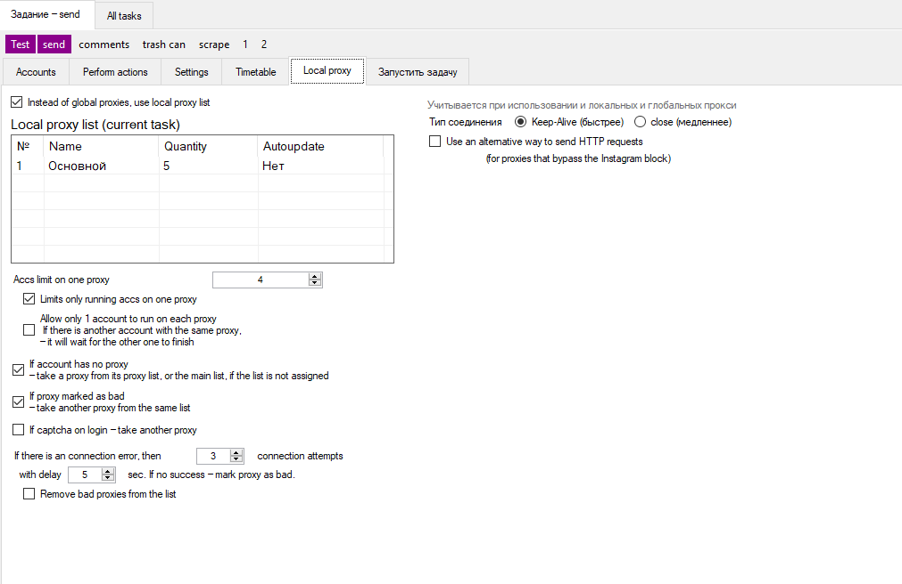
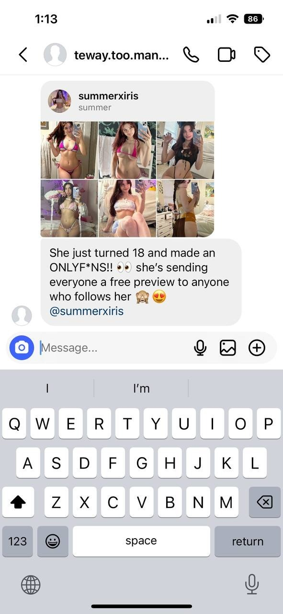

  

<h1 align="center">🚀 InstaBlast</h1>

  Automate smarter. Grow faster. Instagram engagement tools built for results.

---

## 🔧 Features

- 📨 Mass DMs  
- ➕ Follow / Unfollow  
- ❤️ Like  
- 👀 Mass Story View  
- 💬 Comment  
- 🖼️ Post Picture / Video  
- 🚨 Report User  

---

## 💬 Get Access

👉 **Reach out to us on Telegram**: [@instablaster2](https://t.me/instablaster2)

---

## 🖼️ Preview

   
  <em>📊 Dashboard Overview</em>

   
  <em>🛡️ Proxy Settings Panel</em>

   
  <em>📨 Mass DM Results Example</em>

---

## ⚡ Why Mass DM Works

Using Instagram Mass DM for marketing is like cutting through all the noise and speaking directly into someone’s pocket.

Unlike posts or stories that get buried in the algorithm, a DM sends a push notification straight to their phone, just like a message from a friend. That means your offer, your link, your pitch… it gets seen. Fast.

The real power is in how personal it feels. Even if you’re sending messages at scale, each one shows up like a private conversation. People read DMs. They respond to DMs. And when the right message hits the right person at the right time, it converts.

Whether you’re driving traffic to a drop, booking calls, or reviving cold leads, Instagram Mass DM isn’t just marketing,  it’s direct access. No middleman. No guesswork. Just your brand in their inbox, with a notification that demands attention.

It’s one of the few tools left that gives you reach and immediacy. And when used right, it’s a game-changer.

---

## 🧠 Note

This repository contains the frontend UI only. Core automation logic is provided to verified users. Reach out to us to gain access.
